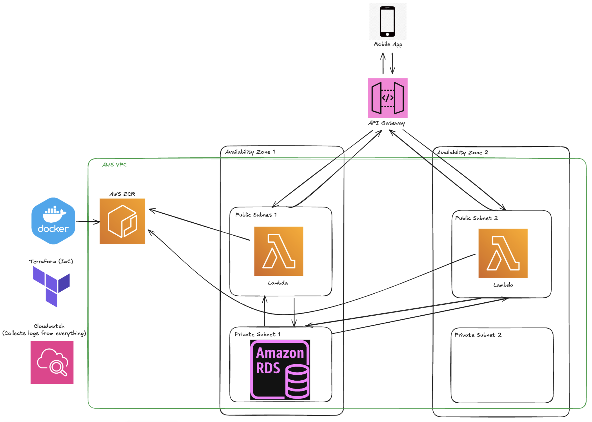

# aws_practice
See the project in action [here](https://www.linkedin.com/posts/william-griner_heres-a-deeper-explanation-the-cloud-architecture-activity-7330838046499635201-H9ln?utm_source=share&utm_medium=member_desktop&rcm=ACoAAEbB8FUBcV2OpSDRUf_6UPde4yrsl9VRh2M)

I used this project to practice my AWS skills regarding: Networking, APIs, Availability, Scalability, and Load Balancing.
 
 
The aws architecture was initially created to use EC2, load balancing, and auto-scaling (instead of lambda), and that initial version of the project can be seen [here](https://github.com/willyg23/aws_practice/tree/0b378fe346bea511106ac5d708a35b9d16e65bdc)
 
 

Architecture Diagram:

(we only used 1 database, because multi-az databases are not in the AWS free tier)
 
 
The project was also used as part of my senior design project, which my team won an [award](https://www.linkedin.com/posts/william-griner_happy-to-announce-that-my-senior-design-group-activity-7330832392368074754-os8e?utm_source=share&utm_medium=member_desktop&rcm=ACoAAEbB8FUBcV2OpSDRUf_6UPde4yrsl9VRh2M) for

